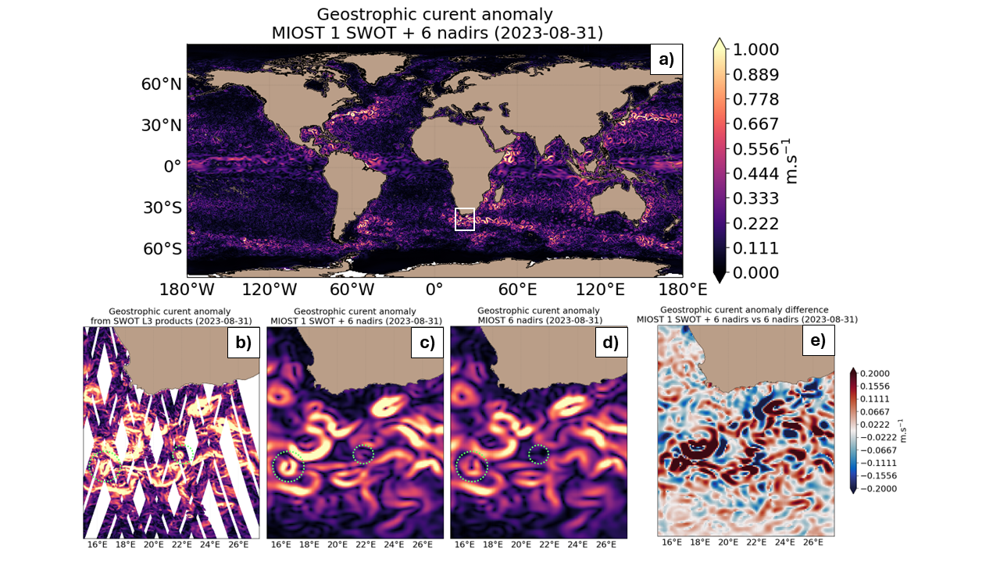

# 2024_DC_SSH_mapping_SWOT_OSE
A challenge on the mapping of real nadirs and KaRin satellite altimeter sea surface height data organised by Datlas and CLS.

## :warning: WORK in progress. This data-challenge is still under construction
  
# SWOT SSH Mapping Data Challenge 2024

This repository contains codes and sample notebooks for downloading and processing the 2024 SWOT SSH mapping data challenge.
Note that this data challenge is a somewhat extended version of the data challenge [2023a_SSH_mapping_OSE]([https://github.com/ocean-data-challenges/2023a_SSH_mapping_OSE]) on a global scale. 
Here, we are using nadirs altimeter data and the new Level-3 Karin data available since August 2023.

# 1. Context & Motivation

Real-time observation of ocean surface topography is essential for various oceanographic applications. Historically, these observations relied mainly on satellite nadir altimetry data, which were limited to observe scales greater than approximately 60 km. However, the recent launch of the wide-swath SWOT mission in December 2022 marks a significant advancement, enabling the two-dimensional observation of finer oceanic scales (~15 km). While the direct analysis of the two-dimensional content of these swaths can provide valuable insights into ocean surface dynamics, integrating such data into mapping systems presents several challenges. This data-challenge focuses on integrating the SWOT mission into multi-mission mapping systems. Specifically, it examines the contribution of the SWOT mission to both the current nadir altimetry constellation (seven nadirs) and a reduced nadir altimetry constellation (three nadirs). 

Several mapping techniques, such as statistical interpolation methods or ocean model assimilation methods, are currently proposed to provide operational maps of ocean surface heights and currents. 
New mapping techniques (e.g. data-driven methods) are emerging and being tested in a research and development context. 
It is therefore becoming important to inform users and developers about the accuracy of scale represented by each mapping system. A sensitivity study of different mapping methods in a SWOT context is also proposed.


<p align="center">
  
</p>
 

The goal of the present data-challenge is:
1) to investigate the contribution of SWOT KaRin data in global & regional mapping systems
2) to investigate how to best reconstruct sequences of Sea Surface Height (SSH) from partial nadir and **KaRin** satellite altimetry observations and in using various mapping method (dynamical, data-driven approach...)

This data challenge follows an _Observation System Experiment_ framework: Satellite observations are from real sea surface height data from altimeter. 
The practical goal of the challenge is to investigate the contribution of SWOT KaRin data and the best mapping method according to scores described below and in Jupyter notebooks.

### Observations
#### Nadirs sea-level anomaly Level 3 products
To produce the gridded sea level maps, we used the global ocean sea level anomaly observations from the Near-Real-Time (NRT) Level-3 altimeter satellite along-track data distributed by the EU Copernicus Marine Service (product reference [SEALEVEL_GLO_PHY_L3_NRT_008_044](https://data.marine.copernicus.eu/product/SEALEVEL_GLO_PHY_L3_NRT_008_044/description)), specifically for the Jason-3, Sentinel-3A, Sentinel-3B, Sentinel-6A, SARAL-Altika, Cryosat-2, Haiyang-2B, missions. This dataset covers the global ocean and is available at a sampling rate of 1 Hz (approximately 7 km spatial spacing).

#### SWOT sea-level anomaly Level 3 products
In addition to the nadir altimetry constellation previously mentioned, we conducted experiments involving the integration of SWOT Level-3 Ocean product (specifically referencing [SWOT_L3_SSH](https://www.aviso.altimetry.fr/en/data/products/sea-surface-height-products/global/swot-l3-ocean-products.html)) during the 21-day phase of the mission. The SWOT_L3_SSH product combines ocean topography measurements collected from both the SWOT KaRIn and nadir altimeter instruments, consolidating them into a unified variable on a 2 km spatial grid spacing. For our investigation, we used version 0.3 & version 1.0 of the product accessible through the AVISO+ portal (AVISO/DUACS, 2023). These data were derived from the Level-2 "Beta Pre-validated" KaRIn Low Rate (Ocean) product (NASA/JPL and CNES).

### Data sequence and use
 
The SSH reconstructions are assessed at global scale and over the period from 2023-08-01 to 2024-05-01.
The SSH reconstructions can also be assessed at regional scale and over the same period from 2023-08-01 to 2024-05-01.

For reconstruction methods that need a spin-up, the **observations** from other period can be used.

The altimeter data from Saral/AltiKa data mentioned above should never be used so that any reconstruction can be considered uncorrelated to the evaluation period.


# 2. Get started


## Installation
:computer: _**How to get started ?**_

Clone the data challenge repo: 
```
git clone https://github.com/ocean-data-challenges/2024_DC_SSH_mapping_SWOT_OSE.git
```
or using SSH: 
```
git clone git@github.com:ocean-data-challenges/2024_DC_SSH_mapping_SWOT_OSE.git
```

create the data challenge conda environment, named env-dc-global-ose, by running the following command:
```
conda env create --file=dc_environment.yml 
```
and activate it with:

```
conda activate env-dc-global-ose
```
then add it to the available kernels for jupyter to see: 
```
ipython kernel install --name "env-dc-global-ose" --user
```
finally, select the "env-dc-global-ose" kernel in your notebook with Kernel > Change Kernel.

You're now good to go ! 


## Download the data

:warning: WORK in progress.

#### A notebook to illustrate how to download and read the global data is available:
:warning: WORK in progress.


#### If you are only interested in regional data, a notebook is available to read online the global data and download only regional data:
:warning: WORK in progress.

The dataset is presented with the following directory structure:

### 1) Data for experiment

##### Nadir alongtrack data (L3 products) for SSH map reconstruction

```
.
|-- alongtrack
``` 

### 2) Data for evaluation

##### Independant nadir alongtrack data (L3 products) for SSH evaluation

```
.
|-- independant_alongtrack
|   |-- al		% DT Altika Drifting Phase Global Ocean Along track SSALTO/DUACS Sea Surface Height L3 product
|   |   |-- 2023
|   |   |   |-- nrt_global_al_phy_l3_1hz_2023*.nc
|   |   |-- 2024
|   |   |   |-- nrt_global_al_phy_l3_1hz_2024*.nc
```

##### Auxiliary data for diagnostics

```
.
|-- sad
|   |-- distance_to_nearest_coastline_60.nc
|   |-- land_water_mask_60.nc
|   |-- variance_cmems_dt_allsat.nc

```

### 3) Data for comparison

##### Reconstruction maps for comparison

```
.
|-- maps
|   |-- mapping_miost_s3a_s3b_s6a-hr			% MIOST reconstruction 3 nadirs			
|   |-- mapping_miost_s3a_s3b_s6a-hr_swot		% MIOST reconstruction 3 nadirs + 1 SWOT
|   |-- mapping_miost_c2n_h2b_j3n_s3a_s3b_s6a-hr	% MIOST reconstruction 6 nadirs
|   |-- mapping_miost_c2n_h2b_j3n_s3a_s3b_s6a-hr	% MIOST reconstruction 6 nadirs + 1 SWOT
```


### Download and read the data

The data can be downloaded locally using the wget command. We recommand that the data be stored in the `data/` repository. 
For example, to download and unzip the experiment alongtrack data:

```
CHANGE: TODO
cd data/
wget https://ige-meom-opendap.univ-grenoble-alpes.fr/thredds/fileServer/meomopendap/extract/MEOM/OCEAN_DATA_CHALLENGES/2023a_SSH_mapping_OSE/alongtrack/* 
tar -xvf alongtrack.tar.gz  
rm -f alongtrack.tar.gz
```


## Evaluation

The mapping methods are evaluated against independent data using two independant datasets:

### Independant nadir SSH data: [Check example 1](https://github.com/ocean-data-challenges/2024_DC_SSH_mapping_SWOT_OSE/blob/main/notebooks/ssh_scores_mapping_miost_c2n_h2b_j3n_s3a_s3b_s6a-hr_swot.ipynb)

The ocean surface topography reconstruction is compared with independant data from Saral/AltiKa altimeter. The metrics available using this independant dataset are:

- Grid boxes statistics (maps)
- Statistics by regimes (scalar scores) 
- Spectral effective resolution (maps)
 

## Data processing

Cross-functional modules are gathered in the `src` directory. They include tools for regridding, plots, evaluation, writing and reading NetCDF files.   


# 3.  Mapping evaluation 

## Check mapping evaluation [here](https://2023a-ssh-mapping-ose.readthedocs.io).


# Acknowledgement


<!---


[](https://doi.org/10.5281/zenodo.5511905)

# SSH Mapping Data Challenge 2021a

This repository contains codes and sample notebooks for downloading and processing the SSH mapping data challenge.

The quickstart can be run online by clicking here:
[](https://binder.pangeo.io/v2/gh/ocean-data-challenges/2020a_SSH_mapping_NATL60/master?filepath=quickstart.ipynb)

## Motivation

The goal is to investigate how to best reconstruct sequences of Sea Surface Height (SSH) maps from partial satellite altimetry observations. This data challenge follows an _Observation System Experiment_ framework: Satellite observations are from real sea surface height data from altimeter. The practical goal of the challenge is to investigate the best mapping method according to scores described below and in Jupyter notebooks.

### Observations
The SSH observations include SARAL/Altika, Jason 2, Jason 3, Sentinel 3A, Haiyang-2A and Cryosat-2 altimeter data. This nadir altimeters constellation was operating during the 20170101-20171231 period. Note that for the mapping the Cryosat-2 altimeter data are not taken in the mapping to perfor the independent assessment of the various reconstructions. 

### Data sequence and use
 
The SSH reconstructions are assessed over the period from 2017-01-01 to 2017-12-31.

For reconstruction methods that need a spin-up, the **observations** can be used from 2016-12-01 until the beginning of the evaluation period (31 days). This spin-up period is not included in the evaluation. For reconstruction methods that need learning from full fields, the **baseline reconstruction** or **duacs reconstrcution** can be used from 2017-01-01 to 2017-12-31. The altimeter data from Cryosat-2  should never be used so that any reconstruction can be considered uncorrelated to the evaluation period.


## Leaderboard

| Method   |   µ(RMSE)  |   σ(RMSE) |   λx (km) | Notes             | Reference                |
|:---------|-----------:|----------:|----------:|:------------------|:-------------------------|
| BASELINE |    0.85 | 0.09 |       140 | Covariances BASELINE OI | [example_eval_baseline.ipynb](https://github.com/ocean-data-challenges/2021a_SSH_mapping_OSE/blob/master/notebooks/example_eval_baseline.ipynb) |
| DUACS    |    0.88 | 0.07 |       152 | Covariances DUACS DT2018 | [example_eval_duacs.ipynb](https://github.com/ocean-data-challenges/2021a_SSH_mapping_OSE/blob/master/notebooks/example_eval_duacs.ipynb) |
| MIOST    |   0.89 | 0.08 |       139 | Multiscale mapping | [example_eval_miost.ipynb](https://github.com/ocean-data-challenges/2021a_SSH_mapping_OSE/blob/master/notebooks/example_eval_miost.ipynb) |
| DYMOST   |   0.89 | 0.06 |       129 | Dynamic mapping | [example_eval_dymost.ipynb](https://github.com/ocean-data-challenges/2021a_SSH_mapping_OSE/blob/master/notebooks/example_eval_dymost.ipynb) |
| BNF      |   0.88 | 0.06 |       122 | BFN mapping | [example_eval_bfn.ipynb](https://github.com/ocean-data-challenges/2021a_SSH_mapping_OSE/blob/master/notebooks/example_eval_bfn.ipynb) |
| 4DVarNet (v2021) |   **0.89** |  **0.06** |       122 | 4DVarNet mapping | [example_eval_4DVarnet.ipynb](https://github.com/ocean-data-challenges/2021a_SSH_mapping_OSE/blob/master/notebooks/example_eval_4dvarnet.ipynb) |
| 4DVarNet (v2022) |   **0.89** | 0.09 |       **109** | 4DVarNet mapping | [example_eval_4DVarnet_v2022.ipynb](https://github.com/ocean-data-challenges/2021a_SSH_mapping_OSE/blob/master/notebooks/example_eval_4dvarnet_v2022.ipynb) |


**µ(RMSE)**: average RMSE score.  
**σ(RMSE)**: standard deviation of the RMSE score.  
**λx**: minimum spatial scale resolved.   
 
## Quick start
You can follow the quickstart guide in [this notebook](https://github.com/ocean-data-challenges/2020a_SSH_mapping_NATL60/blob/master/quickstart.ipynb) or launch it directly from <a href="https://binder.pangeo.io/v2/gh/ocean-data-challenges/2020a_SSH_mapping_NATL60/master?filepath=quickstart.ipynb" target="_blank">binder</a>.

## Download the data
The data are hosted on the [AVISO+ website](https://www.aviso.altimetry.fr/en/data/products/ocean-data-challenges/2021a-ssh-mapping-ose.html) and tagged with DOI: 10.24400/527896/a01-2021.005. The website also provides a data handbook. This is the recommended access. This [wiki](https://github.com/ocean-data-challenges/2020a_SSH_mapping_NATL60/wiki/AVISO---account-creation) can help you create an AVISO account to access the data. The data are also temporarily available [here](https://ige-meom-opendap.univ-grenoble-alpes.fr/thredds/catalog/meomopendap/extract/ocean-data-challenges/dc_data1/catalog.html). They are presented with the following directory structure:

```
. 
|-- dc_obs
|   |-- dt_global_alg_phy_l3_20161201-20180131_285-315_23-53.nc
|   |-- dt_global_c2_phy_l3_20161201-20180131_285-315_23-53.nc 
|   |-- dt_global_h2g_phy_l3_20161201-20180131_285-315_23-53.nc
|   |-- dt_global_j2g_phy_l3_20161201-20180131_285-315_23-53.nc
|   |-- dt_global_j2n_phy_l3_20161201-20180131_285-315_23-53.nc
|   |-- dt_global_j3_phy_l3_20161201-20180131_285-315_23-53.nc
|   |-- dt_global_s3a_phy_l3_20161201-20180131_285-315_23-53.nc

|-- dc_maps
|   |-- OSE_ssh_mapping_BASELINE.nc
|   |-- OSE_ssh_mapping_BFN.nc
|   |-- OSE_ssh_mapping_DUACS.nc
|   |-- OSE_ssh_mapping_DYMOST.nc
|   |-- OSE_ssh_mapping_MIOST.nc
|   |-- OSE_ssh_mapping_4dvarNet.nc
|   |-- OSE_ssh_mapping_4dvarNet_2022.nc (NOT on AVISO+ yet !!!!)
|   |-- mdt.nc

```

## Baseline and evaluation

### Baseline
The baseline mapping method is optimal interpolation (OI), in the spirit of the present-day standard for DUACS products provided by AVISO. OI is implemented in the [`baseline_oi`](https://github.com/ocean-data-challenges/2021a_SSH_mapping_OSE/blob/master/notebooks/baseline_oi.ipynb) Jupyter notebook. The SSH reconstructions are saved as a NetCDF file in the `results` directory. The content of this directory is git-ignored.
   
### Evaluation

The evaluation of the mapping methods is based on the comparison of the SSH reconstructions with the *independent* Cryosat-2 along-track dataset. It includes two scores, one based on the Root-Mean-Square Error (RMSE), the other based on Fourier wavenumber spectra. The evaluation notebook [`example_data_eval`](https://github.com/ocean-data-challenges/2020a_SSH_mapping_NATL60/blob/master/notebooks/example_data_eval.ipynb) implements the computation of these two scores as they could appear in the leaderboard. The notebook also provides additional, graphical diagnostics based on RMSE and spectra.

## Data processing

Cross-functional modules are gathered in the `src` directory. They include tools for regridding, plots, evaluation, writing and reading NetCDF files. The directory also contains a module that implements the baseline method.  

## Acknowledgement

The structure of this data challenge was to a large extent inspired by [WeatherBench](https://github.com/pangeo-data/WeatherBench).


--->
