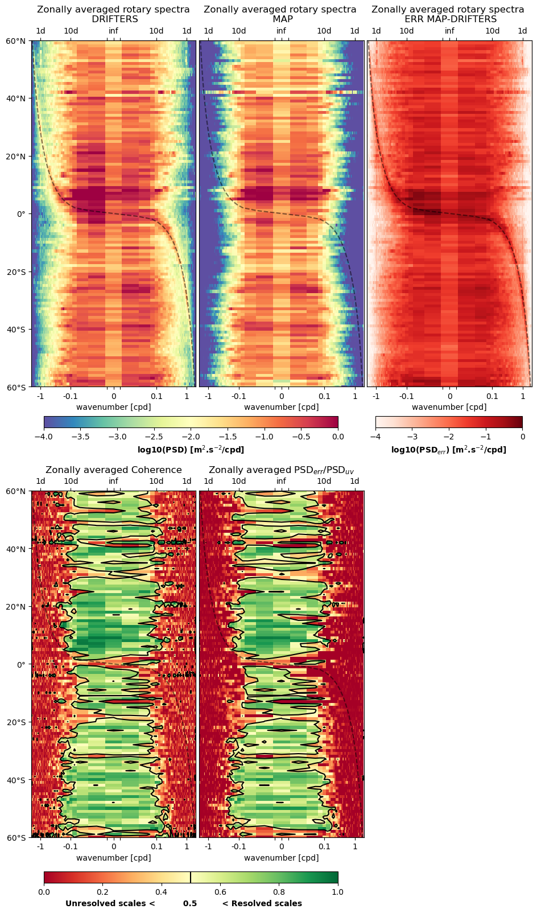

# Currents - Along drifter metrics

 
 

 

In this section, the mapping performances are assessed by comparing the currents products (or estimated geostrophic velocities for methods that only reconstruct SSH) with independent drifter data (available at 6-hour resolution). The ageostrophic component of the observed velocities have not been removed in these reference data. 

## Statistics

[**Check alongdrifter statistics example notebook**](../gallery/alongtrack_statistics_description.ipynb)

 

### &#x2022; Error variance 

Eulerian diagnostics are performed by comparing the estimated currents with the velocities measured by the drifters at each location (in space and time) of the drifters. The methodology used is the same as for the SSH evaluation: the mapped velocities (meridional and zonal components) are interpolated on the drifters' locations and the error variance with the drifters' velocities are aggregated in 1° longitude x 1° latitude boxes.

 
  <i>Figure 1: Global DUACS corresponding geostrophic currents error variance with respect to independent drifter currents for the zonal component (left) and the meridional component (right). </i> 

 

### &#x2022;  Explained variance 

The same process is done to obtained the currents explained variance. 

 
  <i>Figure 2: Global DUACS corresponding geostrophic currents explained variance with respect to independent drifter currents the zonal component (left) and the meridional component (right). </i> 

 

###  &#x2022; Statistics by regime

The statistics displayed in the previous maps are also averaged in specific geographical areas and regimes (<i>coastal, offshore-high variability, offshore-low variability, equatorial band, Arctic, Antarctic</i>) in order to provide a series of scores summarized in the Leaderboards.

 

 

## Spectral

[**Check alongdrifter spectral example notebook**](../gallery/alongtrack_spectral_description.ipynb)

  

### &#x2022; Rotary spectrum and noise-to-signal ratio

Rotary spectrum are a frequently used approach for current data analysis. The idea is to resolve the velocity vector into two rotational components: clockwise and anti-clockwise (Mooers, 1973 ; Gonella, 1972). This allows to represent the current energy distribution between the rotation and the latitude. 
    
The frequency rotary spectra of drifter (artificial from reconstruction and real) velocity (Ee) are computed along the drifter trajectories and displayed as a function of latitude and frequency. The velocity spectra are characterized by high-energy peaks at low frequencies (<0.5 cpd), diurnal, semidiurnal, and latitude-varying inertial frequencies. This diagnostics allows to assess the methods reconstruction skills on certain specific dynamics. 

For instance, the dashed line superimposed to the spectrum corresponds to the inertial frequency, hence, the energy around that dashed line is characteristic of near-inertial oscillation induced currents. This energy can be observed in the real drifter data but is also partly reconstructed by some methods (e.g., WOC product or Glorys12v1 but not in DUACS).   

Also, similarly to the noise-to-signal ratio needed to compute the alongtrack effective resolution, the spectrum of the difference between reconstructed currents and drifter measured currents is divided by the spectrum of the drifter measured currents in order to provide rotation/latitude plots of the noise-to-signal ratio. 

 

## References 

- Gonella, J. (1972, December). A rotary-component method for analysing meteorological and oceanographic vector time series. In Deep Sea Research and Oceanographic Abstracts (Vol. 19, No. 12, pp. 833-846). Elsevier.

- Mooers, C. N. (1973, December). A technique for the cross spectrum analysis of pairs of complex-valued time series, with emphasis on properties of polarized components and rotational invariants. In Deep Sea Research and Oceanographic Abstracts (Vol. 20, No. 12, pp. 1129-1141). Elsevier.
